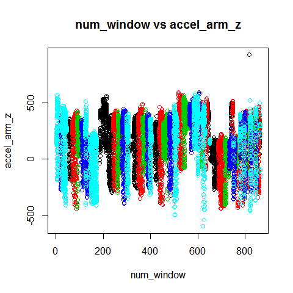

## Overview
The goal of the project assignment is to predict the exercise manner categories from the sampl exercise training data. 
The variable name for prediction is "classe" and the other variables are used to predict "classe" value.
This report describes the steps to built the model, cross validation steps and the expected out of sample error.

## Defining Error Rate
There is no specific requirement for prediction accuracy rate. However, let us set an prediction error rate to be less than 10%.

## Load Training/Test data and split training data for validation
The data loaded from the two .csv files provided. Followind is the R code for loading the data. 

library(caret)   
trn <- read.csv("pml-training.csv", na.strings = c("NA", "", "#DIV/0!"))   
tst <- read.csv("pml-testing.csv", na.strings = c("NA", "", "#DIV/0!"))   

\#Split training data for validation set    
trninx <-  createDataPartition( y = trn$classe, p = .8, list = FALSE )   
trnmod <- trn[trninx,]  
trnvld <- trn[-trninx,]   

## Select features/variables
The dataset contains 160 variable including the prediction variable. As instructed the following variables are used for analysis.

Belt    : accel_belt_x,accel_belt_y,accel_belt_z  
Forearm : accel_forearm_x,accel_forearm_y,accel_forearm_z  
Dumbell : accel_dumbbell_x,accel_dumbbell_y,accel_dumbbell_z  
Arm     : accel_arm_x,accel_arm_y,accel_arm_z   

Following is the R code for variable selection for model generation.
---
trnmodsmpl <- trnmod[,c("num_window",
                                  "accel_belt_x", "accel_belt_y", "accel_belt_z",  
                                  "accel_forearm_x", "accel_forearm_y", "accel_forearm_z",  
                                  "accel_dumbbell_x", "accel_dumbbell_y", "accel_dumbbell_z",  
                                  "accel_arm_x", "accel_arm_y", "accel_arm_z",  
                                  "classe" )]  
  
trntstsmpl <- trnvld[, c("num_window", 
                                    "accel_belt_x", "accel_belt_y", "accel_belt_z",  
                                    "accel_forearm_x", "accel_forearm_y", "accel_forearm_z",  
                                    "accel_dumbbell_x", "accel_dumbbell_y", "accel_dumbbell_z",  
                                    "accel_arm_x", "accel_arm_y", "accel_arm_z",  
                                    "classe" )]  

tstsmpl <- tst[, c("num_window",  
                         "accel_belt_x", "accel_belt_y", "accel_belt_z",  
                         "accel_forearm_x", "accel_forearm_y", "accel_forearm_z",  
                         "accel_dumbbell_x", "accel_dumbbell_y", "accel_dumbbell_z",  
                         "accel_arm_x", "accel_arm_y", "accel_arm_z",  
                         "problem_id" )]  
  
---
The following analysis has been performed to identify the appropriate variables. Following are codes for exploratory analysis including visualisations.

featurePlot(x = trnmodsmpl[,c(1,2)], y = trnmodsmpl$classe, plot = "pairs")  
  
for (i in 1:13)  
{  
  print(i)  
  plot(trnmodsmpl[,2], trnmodsmpl[,i],   
       col = trnmodsmpl$classe, main = i  
       )  
  cat("Press Enter to continue ...")  
  Ln <- readline()  
}  
  
  

## Define the Model
After exploratory analysis, it is evident that the problem is related to clustering problem. I have used few methods and method random forest is providing the best result. I am using preProcessing "pca" to improve the accuracy.

\>modFit <- train(classe ~ ., method = "rf", preProcess = "pca", data = trnmodsmpl)  
  
Following the generated model information  
\> modFit$finalModel  
  
Call:  
 randomForest(x = x, y = y, mtry = param$mtry)   
               Type of random forest: classification  
                     Number of trees: 500   
No. of variables tried at each split: 2  
  
        OOB estimate of  error rate: 6.82%  
Confusion matrix:  
     A    B    C    D    E class.error  
A 4284   49   59   64    8  0.04032258  
B  153 2706   99   38   42  0.10928242  
C   41   76 2570   41   10  0.06135866  
D   36   24  123 2356   34  0.08433735  
E   21   46   37   69 2713  0.05994456  
  

##Cross Validation and expected Out of Sample error
The validation data set is used for calculating the expected error as follows -  
pred <- predict(modFit, trntstsmpl)  
valTab = table(pred,trntstsmpl$classe)  
diag(valTab) = 0  
errRate = sum(valTab)/length(trntstsmpl$classe)   

Output of valTab:  
\>valTab  
pred    A    B    C    D    E  
   A 1074   25   12    9    4  
   B   10  689   21    4   22  
   C   16   24  638   32    9  
   D   16   12   10  594   24  
   E    0    9    3    4  662  
   
Output of errRate:  
\>errRate  
[1] 0.06755034  
##Prediction on Test data  
predTst <- predict(modFit, tstsmpl)  

The predTst provides the prediction of the test data file for the assignment.

